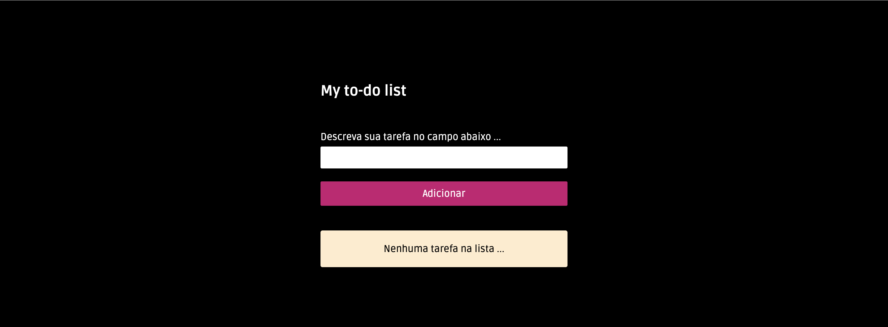
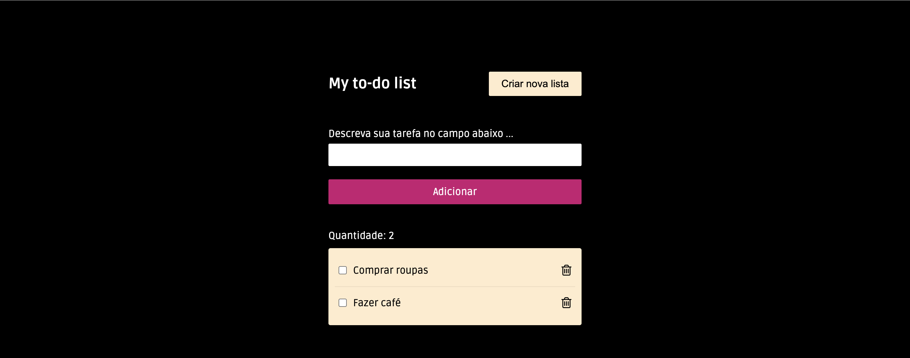
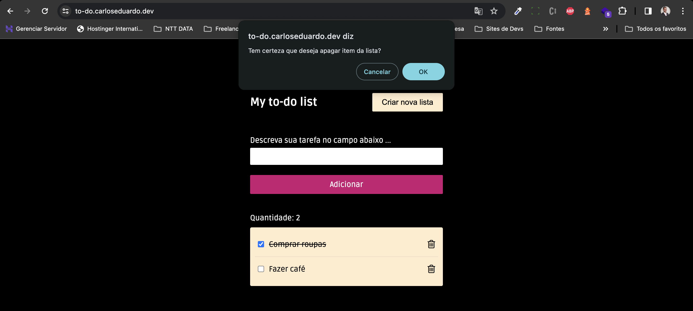

# To-do list

Projeto feito apenas para práticar alguns conceitos aprendidos nos meus estudos diários.

O projeto em si é uma lista de tarefas, onde o usuário poderá cadastrar vários itens no seu dia a dia e usar como lembrete de suas obrigações e a fazeres.

## Screenshots

## Link para acesso

[https://to-do.carloseduardo.dev](https://to-do.carloseduardo.dev)
